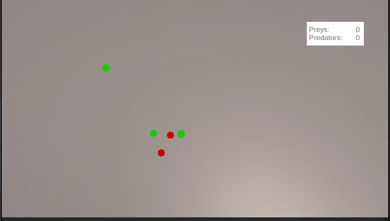

# Test Task DS - Unity Animal Animation Project

A well-structured Unity project demonstrating advanced architectural patterns and clean code practices.

## Key Features & Advantages

### 1. Advanced Architecture
- **MVP Pattern Implementation**: Clear separation of concerns between Models, Views, and Presenters
- **State Machine Pattern**: Robust state management system for handling different animal states and behaviors
- **Dependency Injection**: Utilizing Zenject framework for clean and maintainable dependency management
- **Modular Design**: Clear project structure with separate modules for Animals, UI, StateMachine, and Extensions

### 2. Technical Implementation
- **Unity Animation System**: Integration with Unity's animation system for smooth animal movements and behaviors
- **Clean Code Structure**: Well-organized codebase with clear separation of concerns
- **State Management**: Sophisticated state machine for managing different animal behaviors and animations

### 3. Project Structure
```
├── Animals/           # Animal-related components and behaviors
├── Editor/            # Editor scripts
├── UI/                # User interface elements and controllers
├── StateMachine/      # State management system
├── Extensions/        # Extension methods and utilities
├── Tests/             # Unit and integration tests
└── InitData/          # Configuration for game modules deu to scriptable objects
```

### 4. Design Patterns
- **Dependency Injection (Zenject)**
  - Centralized dependency management
  - Improved testability and modularity
  - Reduced coupling between components

- **State Machine**
  - Flexible state transitions
  - Clear behavior management
  - Easy to extend with new states
  - Based on Scriptable objects 

- **Model-View-Presenter (MVP)**
  - Clear separation of concerns
  - Improved maintainability
  - Enhanced testability

## Technologies Used

- Unity Engine
- Zenject 
- DOTween
- NUnit
- NSubstitude
- UniTask
- R3

## Best Practices

- SOLID principles implementation
- Clean Code practices
- Proper dependency management
- Scalable architecture

## Performance Considerations

- Efficient state management
- Optimized animation system
- Minimal garbage collection impact
- Smart dependency injection with object pooling

## Future Improvements

- Additional animal behaviors
- Enhanced animation system
- More sophisticated AI patterns
- Extended test coverage
- Performance optimizations



P.S. Snakes are red, frogs are green. Frogs could jump very hight but snakes eats them when collides
